## Color

| Attribute            | SCSS                   | HEX                    |
|------------------|------------------------|------------------------|
| Normal           | $brand-01              | #3d70b2                |
| Danger           | $support-01              | #e0182d                |
| Primary:hover    | $brand-02              | #5596e6               |
| Secondary:hover  | $brand-01              | #3d70b2                |
| Disabled         | $brand-01              | #3d70b2 at 50% opacity |

  

    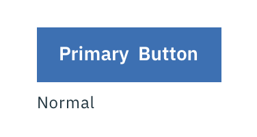
  

  

    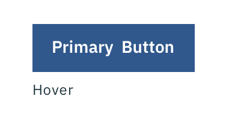
  

  

    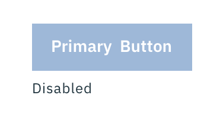
  

  

    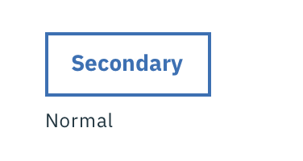
  

  

    
  

  

    
  

  

    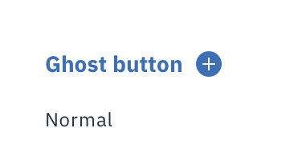
  

  

    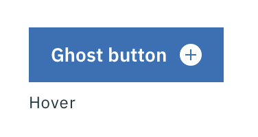
  

  

    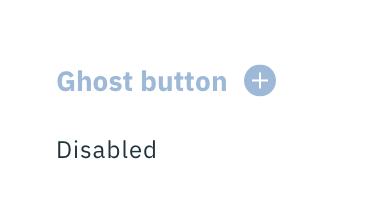
  

_Primary, Secondary, and Ghost Button state examples_

## Typography

Button text should be set in sentence case, with only the first word in a phrase and any proper nouns capitalized.

| Property  | Font-size (px/rem)     | Font-weight  |
|-------------|------------------|--------------|
| Button text | 14 / 0.875 | Semi-Bold / 600   |

## Structure

| Height          | px | rem |
|-----------------|----|-----|
| Regular buttons | 40 | 2.5 |
| Small buttons   | 32 | 2   |

  

    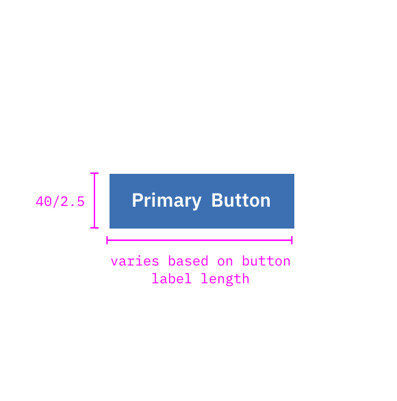
  

  

    
  

_Stucture measurements for small and regular Primary Button | px / rem_

### Spacing

A Button cannot have any element or text within 16 pixels / 1 rem of its borders. For Button groups, the primary button is positioned on the outside of the set, while the secondary button is positioned inside. For a Button with a glyph, the space between the button label and the glyph must be greater than or equal to 16 pixels / 1 rem. This is to accommodate for instances where two or more buttons with glyphs appear together.

| Spacing                 | px | rem  |
|-------------------------|----|-------|
| External: regular button| 16 | 1     |
| Internal: regular button| 16 | 1     |
| Internal: small button  | 10 | 0.625 |
| Button pairings         | 16 | 1     |
| Text & glyph            | 16 | 1     |
| Ghost Button: text & glyph    | 8  | 0.5   |

  

    
  

  

    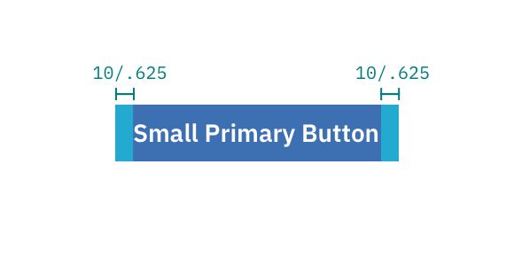
  

  

    
  

  

    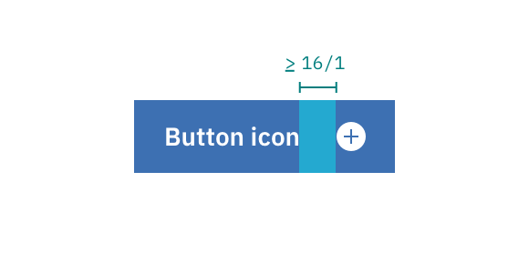
  

  

  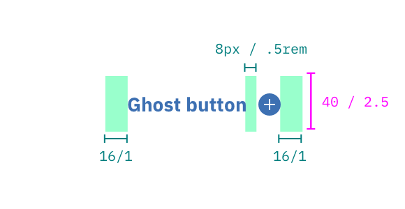
  

  

  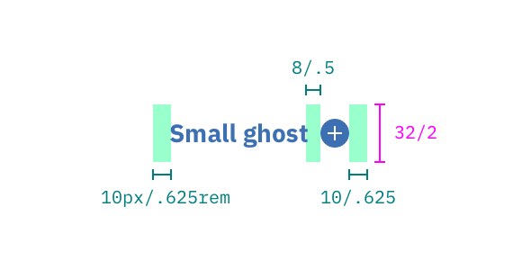
  

_Spacing measurements for various Button types | px / rem_
