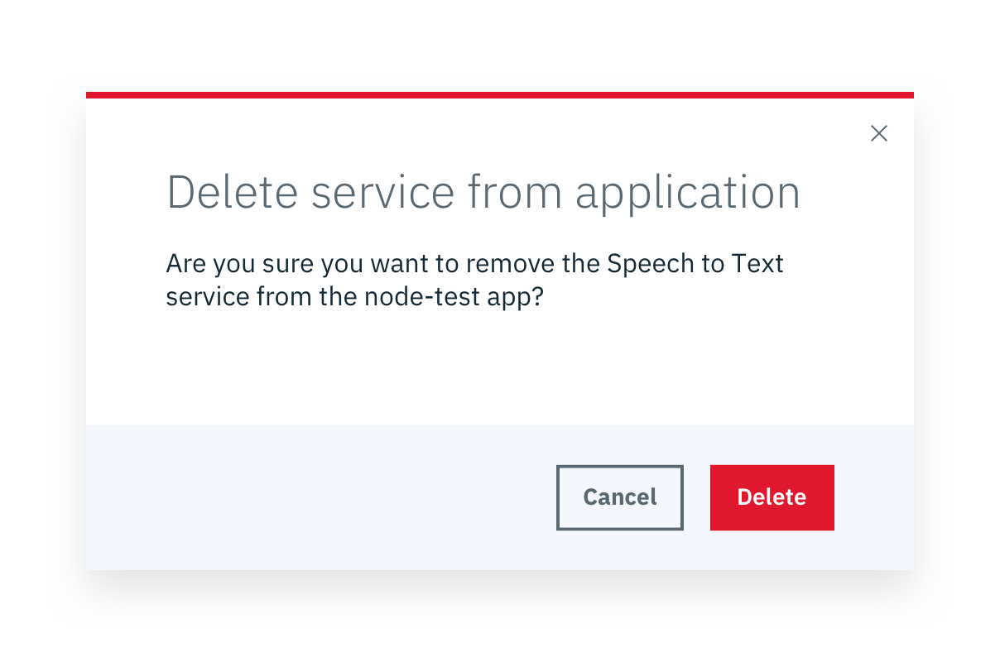

## General guidelines

Buttons are used primarily on action items. Some examples include **Add**, **Save**, **Delete**, **Sign up**. Do not use Buttons as navigational elements. Instead, use [Links](/components/link) because it takes the user to a new page and is not associated with an action. Each page may have one to two primary buttons. Any remaining calls-to-action are represented as secondary buttons.

## Usage

| Button type      | Purpose                                                                                                                                                                                                                                                                                                                                                                                  |
|------------------|------------------------------------------------------------------------------------------------------------------------------------------------------------------------------------------------------------------------------------------------------------------------------------------------------------------------------------------------------------------------------------------|
| Primary          | For the principle call to action on the page.                                                                                                                                                                                                                                                                                                                                            |
| Secondary        | For secondary actions on each page.                                                                                                                                                                                                                                                                                                                                                      |
| Button with icon | When words are not enough, icons can be used in buttons to better communicate what the button does. Icons are always paired with text.                                                                                                                                                                                                                                                   |
| Disabled button  | Use when the user cannot proceed until an input is collected.                                                                                                                                                                                                                                                                                                                            |
| Set of Buttons   | When an action required by the user has more than one option, always use a a negative action button (secondary) paired with a positive action button (primary) in that order. Negative action buttons will be on the left. Positive action buttons should be on the right. When these two types of buttons are paired in the correct order, they will automatically space themselves apart. |
| Small Button     | Use when there is not enough vertical space for a regular sized button.                                                                                                                                                                                                                                                                                                                  |   
| Ghost Button     | When an action does not require primary dominance on the page.  |    
| Danger Button     | When an action has harmful intentions to the users data (delete, remove, etc).   |       

## Labels

Button labels tell users what will happen when they click the button. Use verbs that describe the action, such as **Add** or **Delete**. Use sentence-style capitalization (only the first word in a phrase and any proper nouns capitalized) and no more than three words for button labels.

For Sets of Buttons, use specific labels, such as **Save** or **Discard**, instead of using **OK** and **Cancel**. This is particularly helpful when the user is confirming an action.

For consistency, see [labels and idioms](/guidelines/content/glossary) for the approved list of action labels.

## Icon usage

* Use glyphs (16px) within buttons.
* Glyphs are distinguished by their solid shape and knocked-out details.
* Glyphs should always appear to the right of the text.
* Glyphs used in buttons must be directly related to the action that the user is taking.
* Glyphs must be the same color value as the text within a button.
* Ghost buttons require a glyph icon (cannot be stand alone text because of poor affordance).

_Glyph usage in Buttons_

## Danger button usage
Danger buttons have a different visual style to inform users of potential dangerous actions they are about to take. If using the Danger button as a standalone, we recommend styling it as a **Secondary button**. If using a Danger button within a set, the Danger button would be styled as a **Primary button.** 

_Danger button set_
