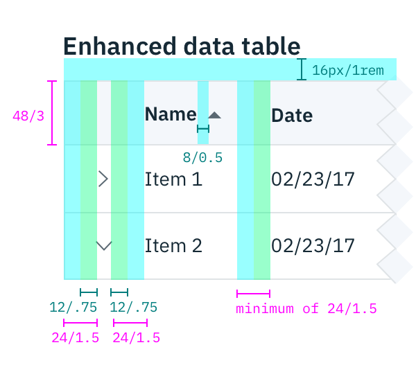
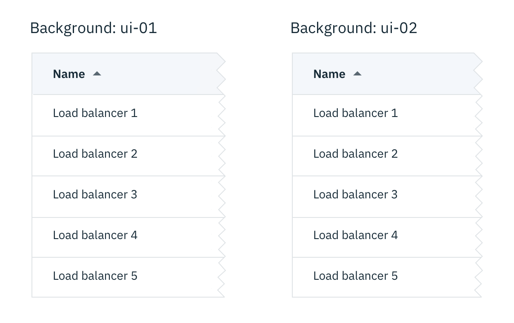
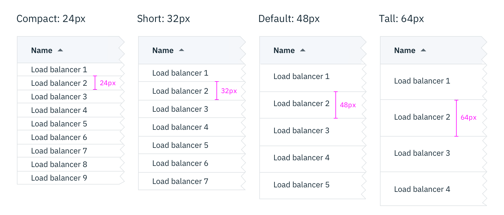
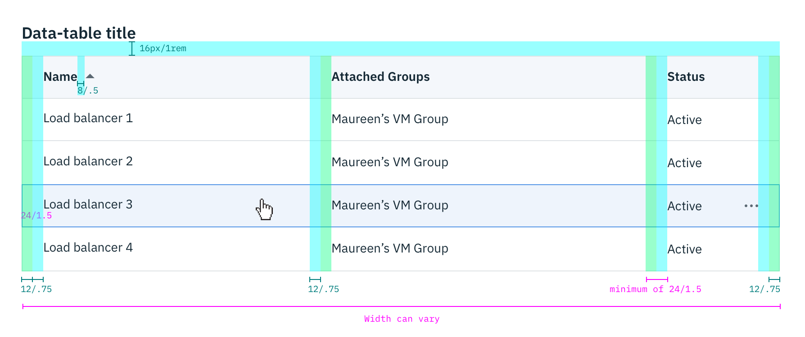
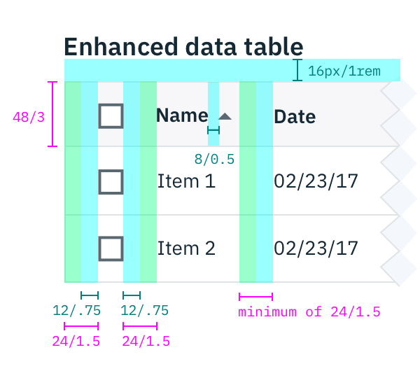

## Color

| COLOR                       | SCSS     | HEX       |
|-----------------------------|--------- |-----------|
| Background                  | $ui-01   | #ffffff   |
| Table header: border-bottom | $brand-01| #3d70b2   |
| Zebra stripe                | $ui-03   | #f0f3f6   |
| Expanded: border-left       | $brand-01| #3d70b2   |
| Text                        | $text-01 | #152935   |
| Chevron & caret             | $ui-05   | #8c9ba5   |

_Example of a Data Table_

## Typography

Column labels should be in all caps. All other table text should be sentenced case.

| PROPERTY      | FONT-SIZE     | FONT-WEIGHT  |
|---------------|------------------|--------------|
| Title         | 23px / 1.4375rem | Light / 300  |
| Header        | 12px / 0.75rem   | Bold / 700   |
| Text          | 14px / 0.875rem  | Normal / 400 |

## Layer

| LAYER    | ELEVATION | BOX-SHADOW  |
|----------|---------- |-------------|
| Flat     | 1         | none        |

## Structure

Tables are a configurable and customizable component. Designers can pick and choose certain elements and interactions.

### Simple data table

The basic table style is the required base from which tables can be developed. Basic tables are composed of a header row followed by rows of data below. At a minimum, tables require three or more columns. Table row heights can be set to narrow or wide and be toggled between the two. Column widths can vary by content and only requires a minimum spacing between columns.

| PROPERTY                | PX | REM  |
|-------------------------|----|------|
| Height: narrow          | 32 | 2    |
| Height: wide            | 44 | 2.75 |
| Height: header          | 40 | 2.5  |
| Width                   | Varies based on content and layout | |
| Chevron                 | 12   | 0.75  |
| Checkbox                | 18   | 1.125 |

  

    
  

  

    
  

_Structure and spacing measurements for narrow and tall rows / Data Table | px / rem_

### Data table

After the simple table structure, tables can be enhanced by adding any of the following: selectable rows, expanding rows, nested tables, row menus, table batch actions, overall table menu, and/or table filter.

| SPACING            | PX   | REM   |
|--------------------|------|-------|
| Title & table      | 16   | 1     |
| Header & caret     |  8   | 0.5   |
| Basic internal     | 24   | 1.5   |
| Enhanced internal  | 16   | 1     |
| Internal elements  | 16   | 1     |
| Between columns    | ≥ 24 | 1.5   |

  

    
  

  

    
  

_Structure and spacing measurements for a basic and an enhanced Data Table | px / rem_

### Toolbar

| PROPERTY               | PX   | REM   |
|------------------------|------|-------|
| Icon height            | 24   | 1.5   |
| Spacing: icons         | 16   | 1     |
| Spacing: icons & table | 14   | 0.875  |

---
***
> 

_Structure and spacing measurements for toolbar icons | px / rem_
