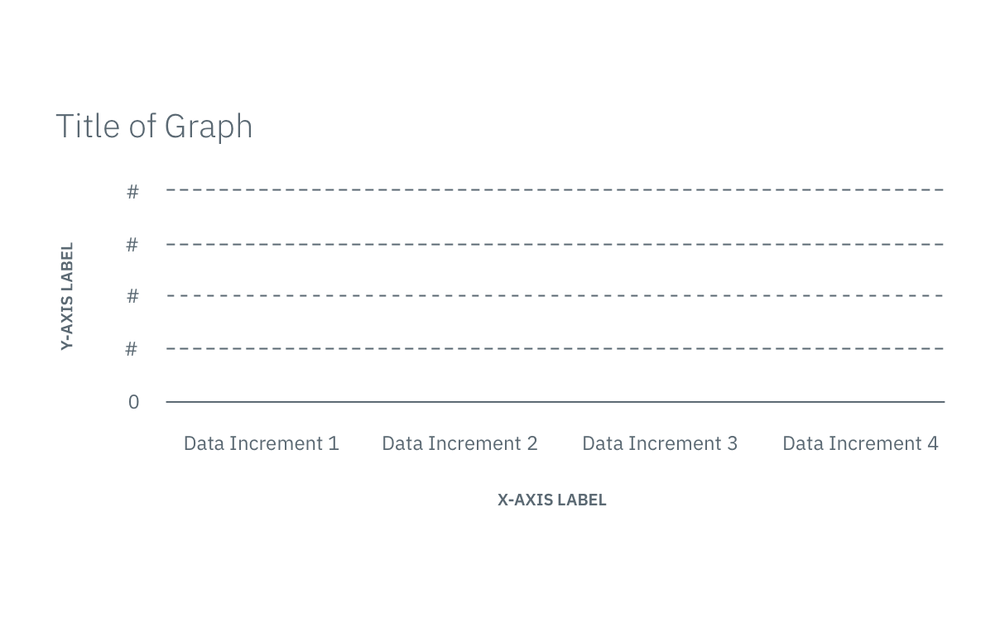

## Graph basics

Data visualization should communicate quantitative information in a way that tells a story about data. Graphs express data visually, making it easy to see the general shape of the data to reveal patterns and trends that text or a table alone cannot.

A graph's story displays the relationship between a set of values, two quantitative values or a quantitative and categorical value. For example, if we were to depict cost over time, cost would be the quantitative value and time would be the categorical value. How this set of values changes over time shows the pattern of their relationship.

An effective visualization provides enough context to show the graph's purpose, whether it is to analyze, communicate, monitor, or plan. Below are basic elements that make up a successful graph.


_Example of base graph with terminology labels_

### Title
A title describes what the graph is about and is set in title case capitalization. It may state the type of quantitative and categorical relationship the data presents, for example "2017 Account Cost by Month."

### X & Y Axes
Typical graphs have two axes, the x-axis that runs horizontally and the y-axis that runs vertically. Together, the axes outline the area where visual information is displayed.

### Axis label
An axis label describes the quantitative or categorical value of an axis. For a quantitative label, make sure to include the unit, either in the label name or in parentheses after it. In this case, "Cost in Dollars" is the y-axis label title and "Time" is the x-axis label title.

### Grid lines
Grid lines are points of reference aligned to data increments that divide the area of a graph into smaller regions, enhancing the ability to notice subtle differences that makes comparing data easier. Grid lines are not required on a graph and can be toggled on as a filter option.

### Data representation
The position where a quantitative and categorical value meet is portrayed as either a point, bar, or line.

### Data increments
Maintain even spacing between data increments to provide a predictable reference and limit the likelihood of distorting data. Keep in mind the larger the data range, the more data increments a graph should contain.

Categorical values should be labeled in logical increments, such as consecutive months. For quantitative values, choose round numbers that fit the given data range and always include an additional increment greater than the dataset. It is also best practice to have a quantitative scale begin at zero to avoid exaggerating value differences.

### Key
A key explains what the plotted data in a graph represents. We recommend using up to six data sets (and no more) in a key because any more loses the comparative value of graphs. The key is generally located to the right of a graph. However, if the amount of items listed in the key exceeds that space or the span of the graph is limited, place the key below.  

### Tooltips

A tooltip appears when hovering over content in a graph, showing the exact value(s) for that point of intersection of the x and y-axes.

### Empty state
Empty states appear when no data is available, which may be due to a number of reasons. When applicable, include a call to action that helps users to get the graph up and running.

### Abbreviations
Abbreviate labels if spacing is a concern. Follow these conventions across graphs:

***
| ATTRIBUTE             | ABBREVIATIONS  |
|-----------------------|--------------- |
| Days of the week      | Sun, Mon, Tues, Wed, Thu, Fri, Sat |
| Months                | Jan, Feb, Mar, Apr, May, Jun, Jul, Aug, Sep, Oct, Nov, Dec  |
| 12 hour time             | 9am, 12pm, 6pm |
| Numbers               | Describe the unabbreviated number in the axis label and use abbreviated numbers in the data increments. For example, the axis label "Cost in thousands" may have data increments 1K, 1.5K, 2K, etc.|
| Currency              | For instance, if an axis label uses "Dollars", the data increment may be $100, $200, $300, etc.


## Accessibility
Data visualization presents some of the most challenging accessibility problems on the web. Although there is no one solution for these challenges, here are our recommendations:

1.
Every data visualization is accompanied by an alternative data table view.

2.
Use an accessible color palette. See the [Colors](/data-vis/overview/colors) tab for more information about colors and how to apply them to your use case.

3.
**Use inline SVG:** SVG 2.0 is currently in a draft state. In the meantime we can make the most of SVG 1.0 by utilizing the "title" and "desc" attributes in combination with ARIA roles and attributes. Below is an example section of code using this techinique. To see a full example go to [Describler](http://describler.com/#intro) and select "aria-bar-chart.svg" from the dropdown on the left. Make sure to turn on your sound so you can hear the chart read to you!

```html
<g id="ChartRoot" role="chart" aria-charttype="bar">
  <g id="dataarea" role="dataset">
    <g id="datapoint_0" role="datapoint">
      <title role="datavalue" aria-labelledby="x-Saturday">8 Hours</title>
    </g>
  </g>
</g>
```

#### _References_
_"The Visual Display of Quantitative Information" by Edward Tufte_

_"The Visual Display of Quantitative Information" by Edward Tufte_

_"Show Me the Numbers: Designing Tables and Graphs to Enlighten" by Stephen Few_

_"Interactive Data Visualization for the Web, 2nd Edition" by Scott Murray_

_"Show Me the Numbers: Designing Tables and Graphs to Enlighten" by Stephen Few_
