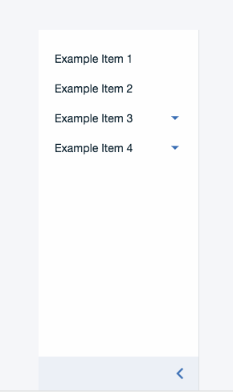
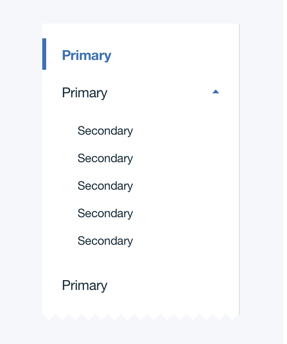

## Usage

The Interior Left Nav occupies the left of the screen and spans vertically from the global header bar to the bottom of the viewport. Use the Interior Left Nav for links that are secondary to the Global Header. This is also helpful when the navigation contains a deeper hierarchy.

## Text

* The text is left-justified, and each title may occupy up to a maximum of two lines of space.
* The Interior Left Nav can fit as many links as needed, but consider the cognitive load on users when the amount of links within the navigation requires scrolling.
* Keep links short and succinct, but descriptive enough that the user can anticipate what page will load.

## Interaction

### Collapse

The Interior Left Nav can be expanded/collapsed by clicking the chevron icon at the bottom of the viewport.

---
***
>

_Interior Left Nav collapse interaction_

### Secondary items

Secondary or child items can exist beneath the primary level of navigation links. If secondary items exist, the parent or primary level item is not an actual destination. Clicking the parent element will trigger an expansion where the secondary items are shown. If an overview or home page is needed for that particular category, include it as the first item in the nested list.

---
***
> 

_Primary and secondary items_
