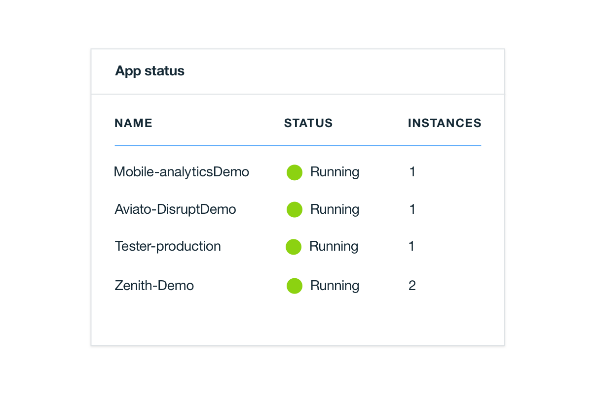
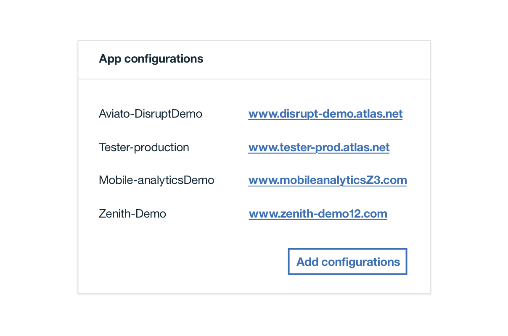

## Usage
Modules are often used on dashboards, where they provide a summary or overview of information that links the user deeper into the product. A Module can be read-only, containing informative content that helps the user understand their data. Modules can also contain smaller, interactive elements that allow the user to take quick actions.

### Empty States
In the case where a Module has no data to display, an empty state must be shown that gives the user guidance on next steps. It is recommended to include an actionary item such as a button or a link that gives the user further direction. 

### Overflow
If Modules have excessive amount of content or data to display then the designer should consider setting a layout appropriate max height to the Module and then applying internal scrolling.

## Structure
### Header
Headers provide consistency and context to the Module. Keep the text short and precise. "View more" links that redirect the user to further content can be included within the header space, and should be right-aligned.

### Body
Modules can contain read-only content or interactive elements (Links, Buttons, Text Inputs). To link a user out to additional content or information, use a link. 

 
 _Read-only Module_

_Interactive Module_

