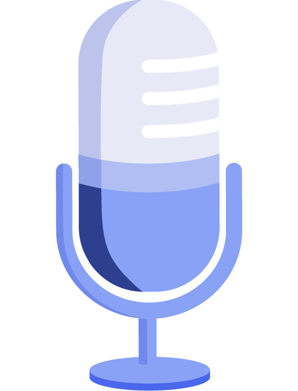
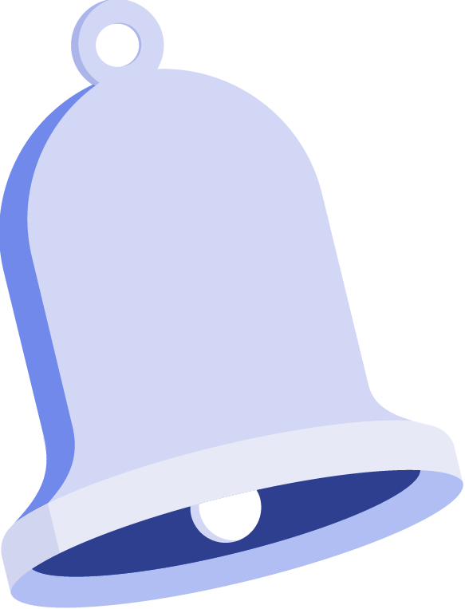

## Voice & Tone
Using the appropriate voice and tone allows us to better connect and resonate with our users. Gone are the days when our users perceive their content experience as complex, distant, or disjointed. We've evolved and we now endorse a style that should feel like a conversation between friends – personal, relatable, clear, helpful, and engaging. Conversational style does not mean sloppy writing. It means creating content in a clear, concise way that anyone can understand. It means genuinely connecting with our users.

What is the difference between voice and tone? Simply put, we have the same voice all the time, but our tone often changes. Consider this: You have one voice, but you most likely use a certain tone when you are having coffee with friends and a different tone when you are meeting with your boss.

> 

**Voice** is the foundation for communicating Bluemix's product and brand message. Our voice expresses the core of our personality, while bringing comfort, ease, and a sense of connection to our users. Our goal is to empower our users to meet their business goals. Be consistent with voice across the platform.

> 

**Tone** conveys your attitude toward what you are writing about and who you are writing to. When you create content – whether its introductory text on the UI, an error message, or a topic in the Docs – you are essentially a storyteller. Good storytellers are experts in two main areas: what they are saying (the important information that the audience needs to know) and how to say it (the experience that they want to create for the audience). Be a good storyteller. 

## Conversation levels

Here's how conversational you should be based on the six stages of the user journey:

> **MOST:** Discover, Try, Buy content

---
“Thanks for joining IBM Bluemix for your free 30-day trial. It's been great having you! Unfortunately, your Bluemix trial account, with IBMid name@domain, is now deactivated because your trial is over. While your account is deactivated, you can't access resources. Don't worry, your apps are not deleted.”

> **MORE:** Getting started interface content (for example, welcome), interface content for remaining experiences (Productive Use, Manage and Upgrade, Leverage and Extend, Get Support)

---
“To start using Bluemix, name your first organization. Think of an org as a project or team that shares resources, such as apps, databases, and other services. Orgs exist in geographic regions, so decide where you'd like to put your first one.

> **LESS:** Instructional content (steps) for how to complete a task

---
“Go to Avatar icon > Account > Notifications to set up general account and spending notifications. Spending notifications are available only for Subscription and Pay-As-You-Go Bluemix account owners.”