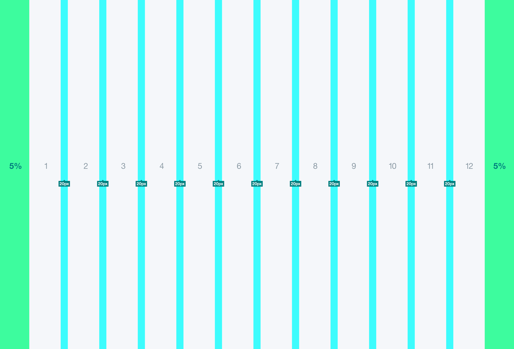
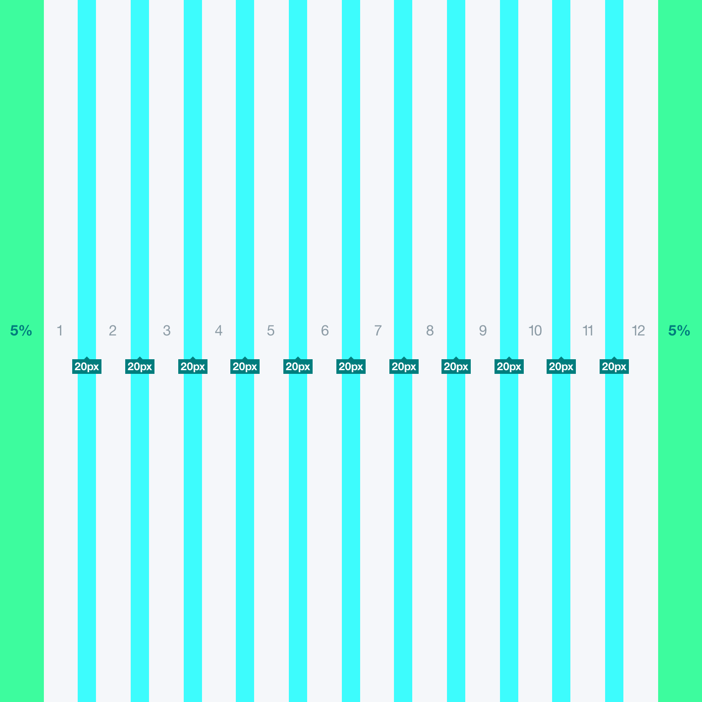
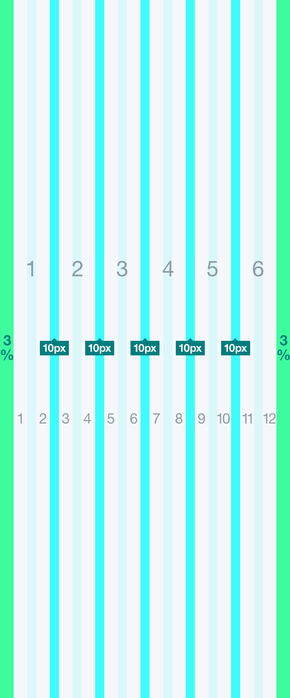

**_Grid_ systems are used for creating page layouts through a series of rows and columns that house your content. Carbon uses a responsive, mobile first, fluid grid system that appropriately scales up to 12 columns as the device or viewport size increases.**

## Basic structure

**

**

**Key:**
Columns / Gutter / Margins

### Grid with interior left navigation
The Interior Left Nav lives outside the bounds of the grid. When using the interior left navigation, start the grid after indenting 200px from the left edge of the page (200px being the fixed width of the left navigation). Normal grid rules apply within the content area.

**Grid area with left navigation: page width minus 200px from left edge.**

## How it works
### Gutters
Columns create gutters (gaps between column content) through padding. For devices with a screen width greater than 768px, the column padding is 20px. For devices with a screen width less than 768px, the column padding is 10px.

**Screen width ≥ 768px = 20px gutters**

**Screen width < 768px = 10px gutters**

### Columns
Carbon designs should be limited to twelve columns. If designers feel that they need fewer columns in their grid, they can specify the number of twelve available columns they wish to span.

This can translate to percentages of the twelve columns. Using this method, a designer can create a folded, less granular grid. For example, if your component spans three equal columns, that is equal to 25% of twelve columns.

**Column count: 12**

_@1440px - 12 Columns / 20px Gutters / 5% Margins_

### Margins
The twelve column grid does not have a maximum width. It has a width of 100%, with built in margins that create padding between column count and the edges of the viewport.

In devices with a screen width greater than 768px, the margins are 5% on the left, and 5% on the right.

**Example: Screen Width 768px**

* 5% left = 38px (rounded to nearest whole pixel)
* 5% right = 38px (rounded to nearest whole pixel)
* 12 columns + gutters = 768px - 38px - 38px = 692px (rounded to nearest whole pixel)

In devices with a screen width less than 768px, the margins are 3% on the left, and 3% on the right.

**Example: Screen Width 320px**

* 3% left = 10px (rounded to nearest whole pixel)
* 3% right = 10px (rounded to nearest whole pixel)
* 12 columns + gutters = 320px - 10px - 10px = 300px (rounded to nearest whole pixel)

### Breakpoints

| SIZE                         | COLUMNS | GUTTERS            | OUTER MARGINS     |
|-------------------------------------|---------|-----------------------|--------------------|-------------------|
| XS (<768px) | 12      | 5px + 5px = 20px   | 3% left, 3% right |
| S (≥768px)      | 12      | 10px + 10px = 20px | 5% left, 5% right |
| M (≥992px)     | 12      | 10px + 10px = 20px | 5% left, 5% right |
| L (≥1200px)     | 12      | 10px + 10px = 20px | 5% left, 5% right |
