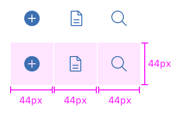

**_Iconography_ uses images and symbols to represent an object visually. They communicate a message and should be simple, distinct, and informative. Icons should be used sparingly throughout the product to provide clarity and reduce cognitive load on users.**

## Resources
You can find the source file for the icon library within the [Carbon Design Kit.](https://github.com/carbon-design-system/design-kit)

- [Bluemix Icons GitHub repo]()
- [IBM Design Language icon library](http://www.ibm.com/design/language/resources/icon-library/)


## Visual usage
### Sizing
Icons come in two sizes: 24px and 16px.
While most icons occupy a square artboard, some icons may occupy a rectangular artboard where the width or height of the icons is either 24px or 16px. In most cases, you can use icons at their original sizes.

| NAME     | PX |
|----------|----|
| Standard | 24 |
| Glyph    | 16 |


### Background
All icons should be on a transparent background and centered within the artboard boundaries at one of the below standard dimensions.

---


### Padding
When **creating icons:**
Do not add internal padding with Sketch or Illustrator.
If the icon needs padding, developers can add this with CSS.

When **using icons:** All touch targets need to be 44px or higher. With that said, a developer can add padding to a touch target with CSS to meet the 44px requirement.

---


### Color
Interactive UI icons need to pass the same color contrast ratio as typography at a 4.5:1 ratio. UI icons are always a solid color. The color of the icon should depend on the importance of the icon's action.


|                        | SCSS      | HEX     |
|------------------------|-----------|---------|
| Primary action         | $brand-01 | #3d70b2 |
| Primary action:hover   | $brand-02 | #5596e6 |
| Secondary action       | $ui-05    | #8c9ba5 |
| Secondary action:hover | $brand-01 | #3d70b2 |


**Exception:** There is an exception to both the Blue and Neutral color rules. Certain icons, such as status or notification icons, can inherit their parent color. For example, a warning icon is yellow because warning notifications are yellow.

### Weight
Icons of the same size should have the same visual weight. One icon should not look heavier or lighter than another icon of the same size. Most UI Icons are drawn with a two pixel stroke.

Be mindful when resizing icons, make sure that the 2px stroke does not increase or decrease causing icons to look uneven. When scaling icons you should always start each icon at the same base size (preferably the default of 24px).

Glyphs or 16 pixel icons, should always be a filled icon. This adds visual weight to the icon, allowing it to maintain its proper emphasis and stay legible. Fine stroke weights can disappear or break at the glyph size.

### Pixel grid
When drawing or re-sizing icons make sure the vector always aligns to the base pixel grid. This ensures pixel clarity and crispness on all screen ratios. The x and y coordinates of icons should never contain decimals.


## Developer usage

### Using SVG sprite (recommended)

**Requirements:**

- Install `@console/bluemix-icons`
- Use `svgxuse` polyfill

Full installation details in [GitHub](https://github.ibm.com/Bluemix/bluemix-icons/blob/master/docs/install.md).

### Using SVG sprite from static assets (recommended)

Use the SVG sprite (__bluemix-icons.svg__) by serving it as a static asset.
Then reference the SVG icon you want to display using a path to the SVG sprite file.
To use SVG sprite files, they __must__ be distributed through a web server and while using `svgxuse`.

```html
<!-- From static assets  -->
<svg>
  <use xlink:href="/path_to_static-assets/bluemix-icons.svg#icon_name"></use>
</svg>
```

`path_to_static-assets` is the path to your static assets where `bluemix-icons.svg` is located.


`icon_name` is the icon name, which will display the corresponding icon. Refer to the [iconography library page](http://carbondesignsystem.com/style/iconography) for a full list of icon names.

### CSS

You can override size and color with CSS.

```html
<svg class="icon">
  <use xlink:href="/path_to_static-assets/bluemix-icons.svg#icon_name"></use>
</svg>
```

```css
.icon {
  width: 24px;
  height: 24px;
  fill: red;
}
```

All icons in the library are standarized so that they do not include `stroke` or internal spacing (`padding`).

### Inline SVG

If you're unable to use the recommended SVG sprite or `svgxuse`, you can inline SVG directly into your HTML.

Visit bluemix-icons and browse the [svg folder](https://github.ibm.com/Bluemix/bluemix-icons/tree/master/svg) for any icons you want to use. (Remember, svg subfolders contain deprecated icons. Don't use these).

### Main files

Bluemix Icons ships with two main SVG files that contain different sets of external SVG sprite files:

| filename | description | supported versions|
|-----|--------|---------------|
|bluemix-icons.svg| Contains current icons (consolidated subset of legacy icons used in Bluemix) | `3.x` and newer|
|bluemix-icons.json| JSON file created from bluemix-icons.svg, used in [Carbon](http://carbondesignsystem.com/style/iconography/library) | `3.x` and newer|
|bluemix-icons.js| JS module created from bluemix-icons.svg, used in `Icon` React Component in [bluemix-components-react](https://github.ibm.com/Bluemix/bluemix-components-react) | `3.x` and newer|
|sprite.svg| SVG sprite contains legacy icons | `1.x`, `2.x` and `3.x`|
|icons.json| legacy JSON file created from sprite.svg | `1.x`, `2.x` and `3.x`|
|legacy-icons.js| JS module created from sprite.svg | `3.x` only|


### Accessibility

For screen reader accessibility, use `<title>` element and `aria-labelledby` attribute.

```html
<svg class="icon--add" aria-labelledby="add">
  <title id="add">Add a new service</title>
  <use xlink:href="https://dev-console.stage1.ng.bluemix.net/api/v4/img/sprite.svg#common--add"></use>
</svg>
```
The `aria-labelledby` attribute will reference the `id` attribute in the the `<title>` element.
Make sure that you do not duplicate this `id`.


The `<title>`element will be read by the screen reader to the user so it should describe it's purpose.
